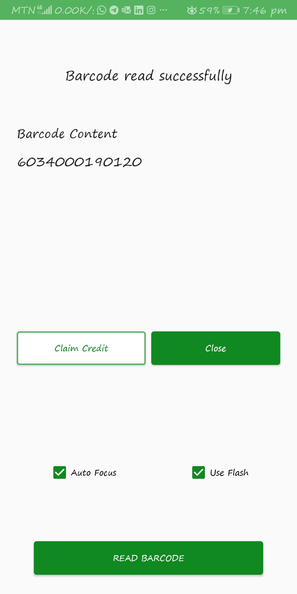
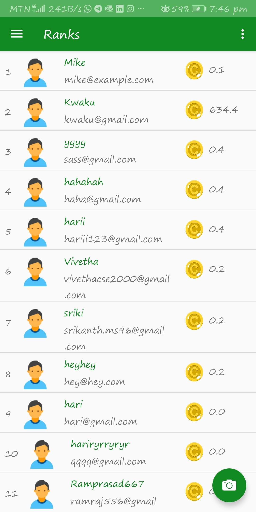
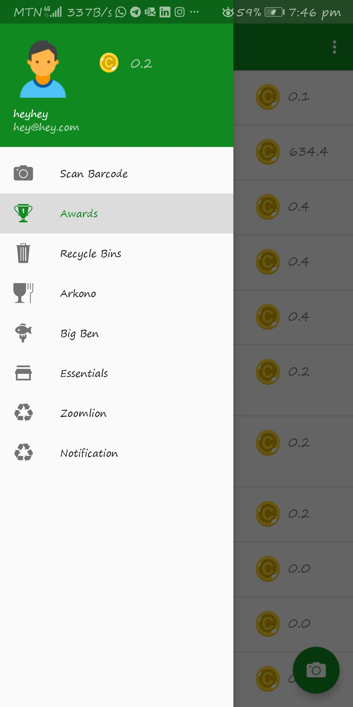
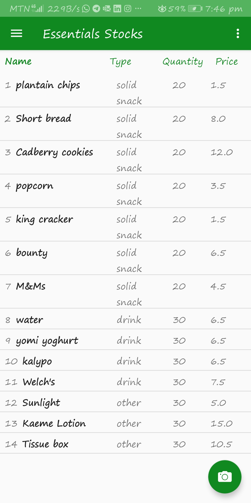
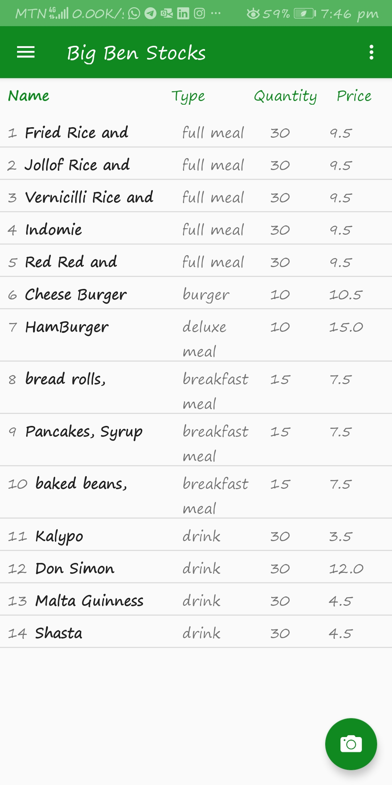
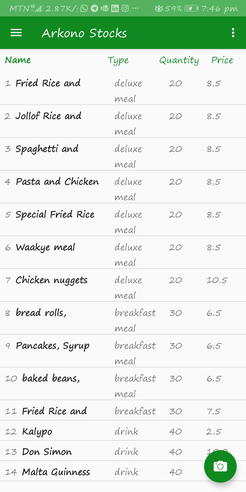
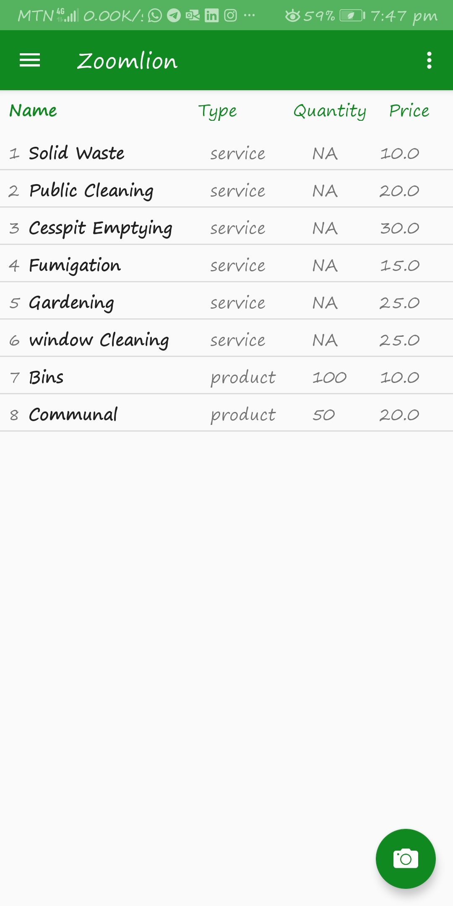
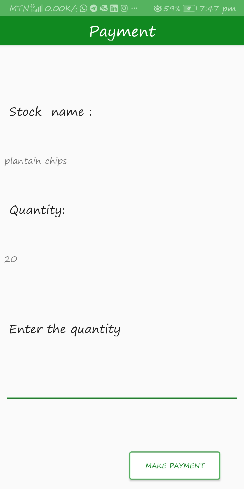
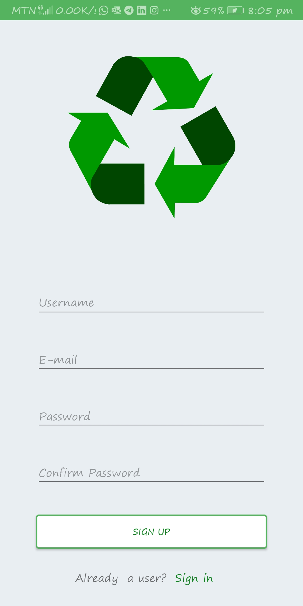

# Waste Management
An android application to manage recycling of waste products. User are credited GHC 20 Ghana pesewas when barcodes/QR codes of waste products are successfully scanned.

*The app depends on **Google Vision Api** and **Firebase authentication and database**.*

**Screenshots**

